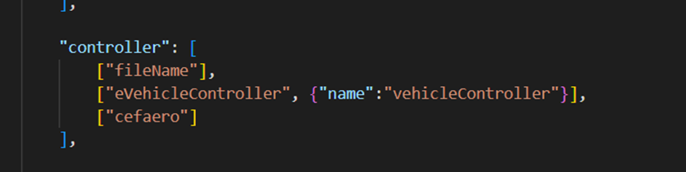

### Hybrid

This is a mod for cars exported from automation the car company tycoon game in BeamNG.drive to turn into hybrid cars.
Here is the guide for using it.

1. Export the car and cancel "Zip-Pack Mod".
    

2. Download the pack from GitHub.
    https://github.com/NiZhaZi/Beamng-Hybrid-Mod
    https://github.com/NiZhaZi/Hybrid-PC-Edit/releases
    https://github.com/NiZhaZi/Torque-Table-Creator/releases
    
    
    

3. Unzip the zip file from the first link of step 2. Copy all files under "hybrid" folder to the folder of exported car.
    
    
    

4. Run the .exe file downloaded from the second link. Choose the form of hybrid and click the "copy" button.
    

5. Open the .pc file of the car which is waiting for being modified and paste the content under "parts" part. Comment the duplicate lines. If the function is not needed, the content in the quotation marks can be deleted.
    
    
    

6. Start the game and choose the car to check if the car was modified correctly. Some parts can be exchanged in the game menu.
    
    

7. The "controller" part of the "main" slot of the car can be edited like this to allow AI in the game to drive the modified car.
    
    